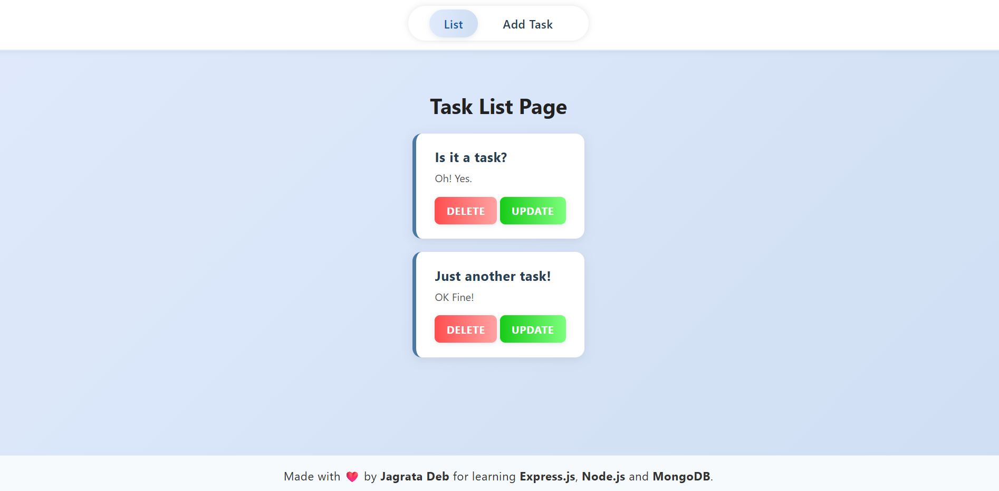
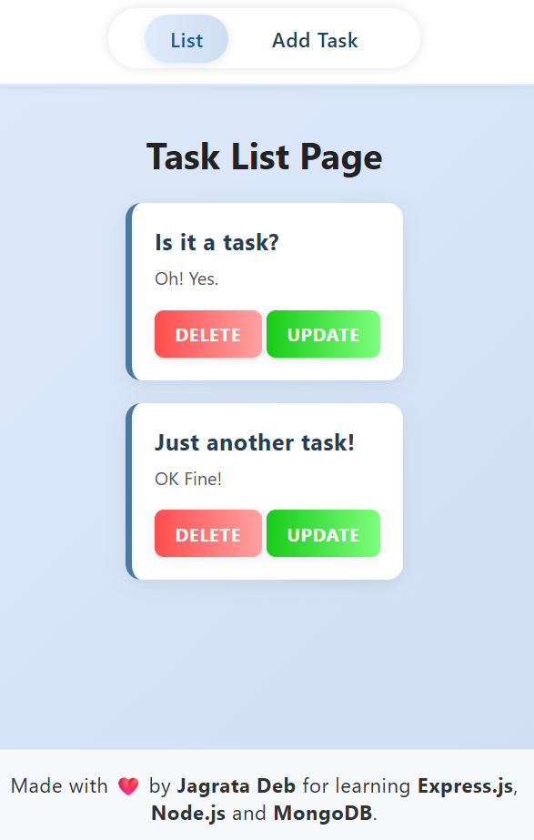

# To-Do List App

A simple and modern To-Do List web application built with Node.js, Express.js, MongoDB, and EJS. This project is designed for learning and practicing full-stack development with a clean UI and CRUD operations.




## Features

- Add new tasks with title and description
- View all tasks in a list
- Update existing tasks
- Delete tasks
- Responsive and modern UI
- Persistent storage using MongoDB

## Technologies Used

- Node.js
- Express.js
- MongoDB
- EJS (Embedded JavaScript Templates)
- CSS (custom, modern design)

## Getting Started

### Prerequisites
- Node.js and npm installed
- MongoDB running locally (default: `mongodb://localhost:27017`)

### Installation
1. Clone the repository:
   ```bash
   git clone https://github.com/jagratadeb/to-do-list.git
   cd to-do-list
   ```
2. Install dependencies:
   ```bash
   npm install
   ```
3. Start the server:
   ```bash
   nodemon index.js
   ```
4. Open your browser and go to [http://localhost:3200](http://localhost:3200)

## Project Structure

```
├── public/
│   └── style.css         # App styles
├── views/
│   ├── add.ejs           # Add task page
│   ├── list.ejs          # Task list page
│   ├── update.ejs        # Update task page
│   ├── navbar.ejs        # Navigation bar
│   └── footer.ejs        # Footer
├── index.js              # Main server file
├── package.json          # Project metadata and dependencies
├── .gitignore            # Files to ignore in git
└── README.md             # Project documentation
```

## Usage
- **List Tasks:** Home page displays all tasks.
- **Add Task:** Click "Add Task" in the navbar, fill the form, and submit.
- **Update Task:** Click "Update" next to a task, edit details, and submit.
- **Delete Task:** Click "Delete" next to a task to remove it.

## Author
- Jagrata Deb

---
Made with ❤️ for learning Express.js, Node.js, and MongoDB.